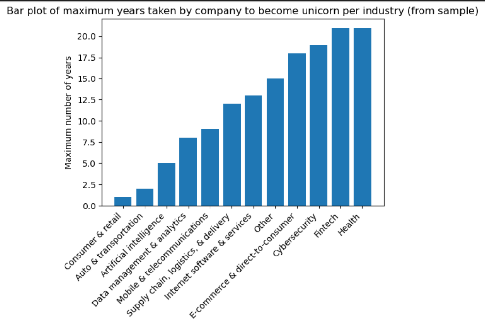
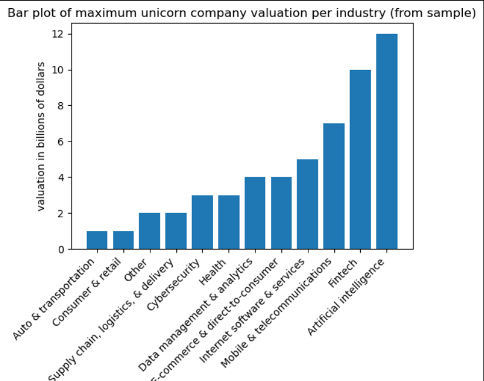
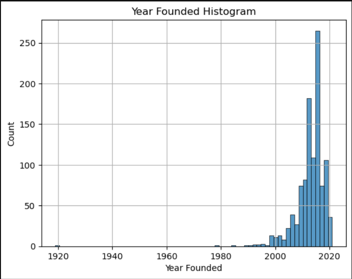
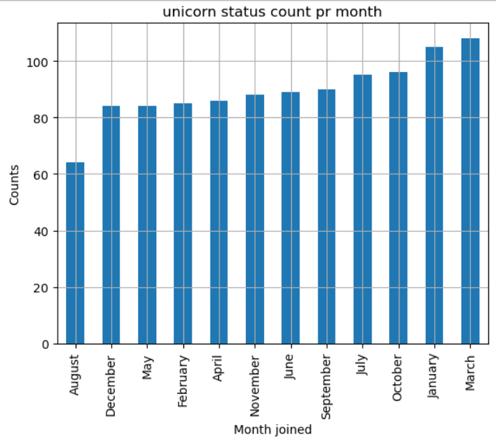
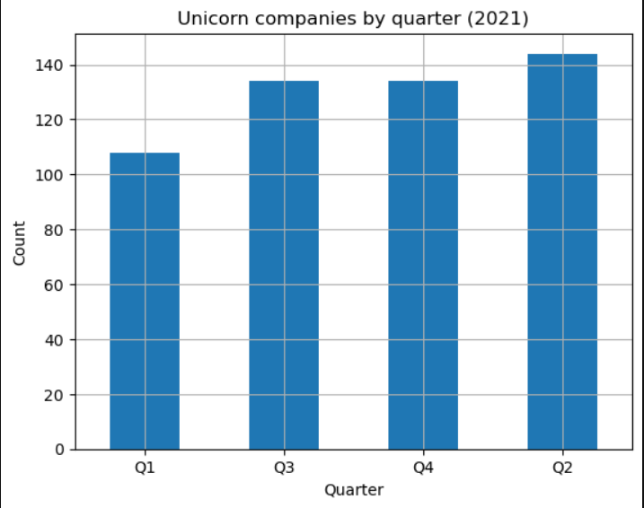
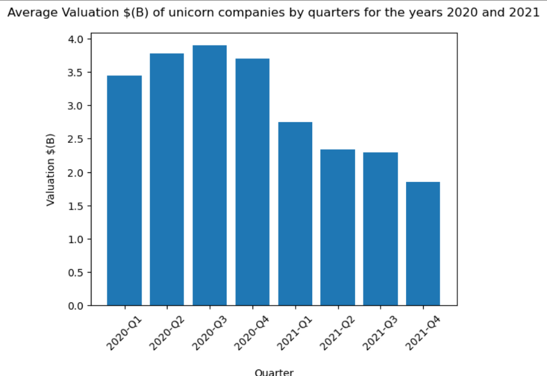
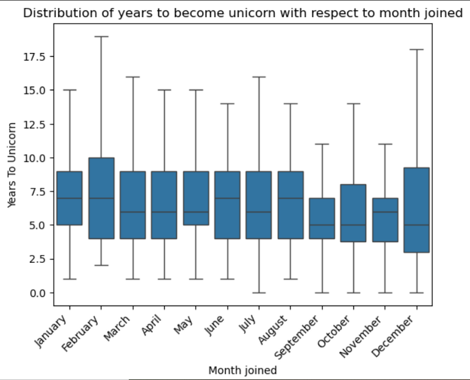
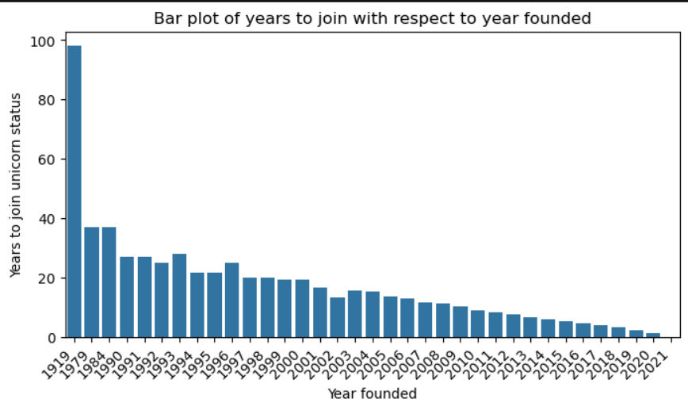
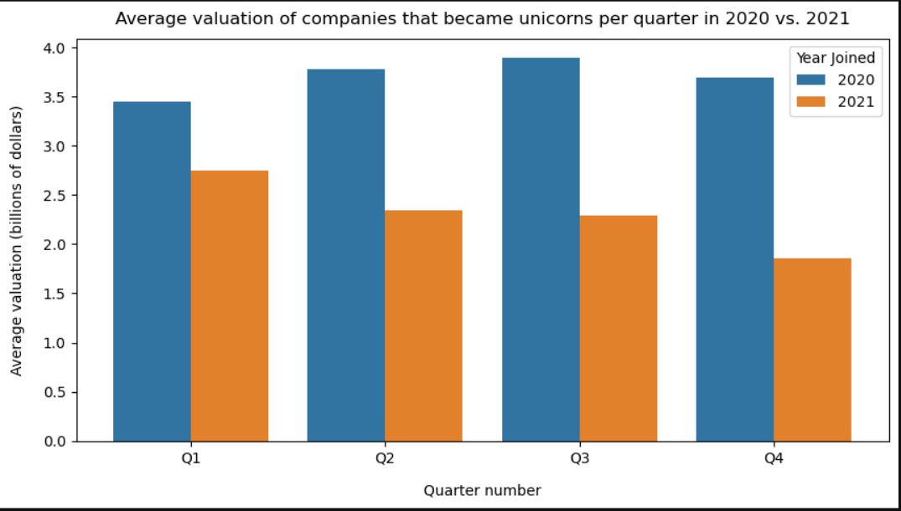

# 🦄 Unicorn Companies Exploratory Data Analysis (EDA)

## Table of Contents

- [Introduction](#introduction)
- [Objectives](#objectives)
- [Dataset Information](#dataset-information)
- [Tools & Technologies](#tools--technologies)
- [Data Cleaning](#data-cleaning)
- [Exploratory Data Analysis (EDA)](#exploratory-data-analysis-eda)
- [Visualizations](#visualizations)
- [Key Findings](#key-findings)
- [Recommendations](#recommendations)
- [Conclusion](#conclusion)
- [Future Improvements](#future-improvements)
- [Author](#author)
- [Contact](#contact)

---
## Introduction

In this project, I explore a dataset of unicorn companies to identify trends, patterns, and insights that can help investment firms make informed investment decisions. Through exploratory data analysis (EDA), I examine company valuations, founding years, industries, geographic distribution, and the time required for companies to achieve unicorn status. The goal is to uncover factors associated with high-growth companies and provide data-driven insights for potential investment opportunities.
## Project Overview
This project analyzes a dataset of 1,074 unicorn companies using Python, Pandas, Matplotlib, and Seaborn. The analysis includes data cleaning, exploratory data analysis, and visualization to identify trends in valuation, industries, and company growth.
## Objectives

1. Visualize the time it took companies to reach unicorn status.
2. Visualize the maximum unicorn company valuation per industry.
3. Sort the dataset to gain insights into the latest unicorn companies.
4. Determine the number of companies founded each year.
5. Count unicorn companies by month.
6. Observe trends over time by identifying the quarter in which the most companies became unicorns in 2021.
7. Compare valuation trends across quarters for the years 2020 and 2021.
8. Visualize the time it took companies to become unicorns.
---
## Dataset Information

The dataset contains information on 1,074 unicorn companies from various countries and industries around the world. It includes details related to company valuation, founding year, funding, industry classification, geographic location, and the date each company achieved unicorn status.
#### Dataset

Source: [Unicorn Companies Dataset](https://drive.google.com/file/d/1QJf93hPKyHRaUe-CuA4wJsK7JcThxuX9/view?usp=drive_link)

  #### Features

* **Company** – Name of the unicorn company
* **Valuation** – Company's estimated valuation
* **Date Joined** – Date when the company achieved unicorn status
* **Industry** – Industry category of the company
* **City** – City where the company is based
* **Country/Region** – Country or region where the company operates
* **Continent** – Continent of the company's location
* **Year Founded** – Year the company was established
* **Funding** – Total funding received by the company
* **Select Investors** – Key investors associated with the company
---
## Tools & Technologies
- Python

- Pandas

- NumPy

- Matplotlib

- Seaborn

- Jupyter Notebook

---
## Data Cleaning

The following data cleaning and preparation steps were performed:

1. Inspected the dataset structure and data types using `.info()`.
2. Checked for missing values across all columns
3. Converted the `Date Joined` column to datetime format.
4. Created additional date-related features (month, quarter, and year) for analysis.
5. Standardized and prepared the data for exploratory data analysis and visualization.

---
## Exploratory Data Analysis (EDA)

The following analyses were conducted to explore trends and patterns in the unicorn companies dataset:

1. Determined the number of companies founded each year.
2. Counted unicorn companies by month.
3. Analyzed the distribution of companies that achieved unicorn status in each quarter of 2021.
4. Examined the time required for companies to become unicorns.
5. Compared company valuations across quarters for the years 2020 and 2021.
6. Identified the maximum unicorn company valuation by industry.
7. Explored trends among the most recently founded unicorn companies.
8. Investigated the relationship between founding time and the time taken to achieve unicorn status.

---
## Visualizations

### Contents

- [1. Time Taken by Companies to Become Unicorn](#1-time-taken-by-companies-to-become-unicorn)
- [2. Maximum Valuation per Industry](#2-maximum-valuation-per-industry)
- [3. Number of Companies Founded Each Year](#3-number-of-companies-founded-each-year)
- [4. Unicorn Companies by Month](#4-unicorn-companies-by-month)
- [5. Unicorn Companies by Quarter (2021)](#5-unicorn-companies-by-quarter-2021)
- [6. Average Valuation by Quarters (2020–2021)](#6-average-valuation-by-quarters-20202021)
- [7. Years to Become Unicorn by Month Joined](#7-years-to-become-unicorn-by-month-joined)
- [8. Time Founded vs Time to Become Unicorn](#8-time-founded-vs-time-to-become-unicorn)
- [9. Average Valuation Over the Quarters (2020–2021)](#9-average-valuation-over-the-quarters-20202021)

The following visualizations were created to identify trends and patterns in the unicorn companies dataset:

### 1. Time Taken by Companies to Become Unicorn

This visualization shows the number of years companies took to achieve unicorn status.

#### insights
- Consumer and transporation companies became the unicorn within 1-2 years after launching
- Fintech and Health companies took the longest to become an unicorn

---

### 2. Maximum Valuation per Industry

This chart compares the maximum valuation of unicorn companies across different industries.

####  insights
- AI company has the highest valuation
- Retail and transporation companies have the lowest valuation even after reaching the unicorn status earliest

---

### 3. Number of Companies Founded Each Year

This visualization shows the yearly distribution of unicorn company foundations.

#### Insights
- Most comapanies were found in the year 2015 and 2016
- The histogram is left skewed because most of the companies were founded after 2005

---
### 4. Unicorn Companies by Month

This chart shows the number of companies that achieved unicorn status by month.

---

### 5. Unicorn Companies by Quarter (2021)

This visualization identifies the quarter in which the highest number of companies became unicorns in 2021.

#### Insights
- Q2 (2021) has the highest number of unicorn companies

---

### 6. Average Valuation by Quarter (2020–2021)

This chart compares average company valuations across quarters for 2020 and 2021.

### Insights
- It is clear that the average valuation of the unicorn companies in the year 2020 was higher in every quarter

---

### 7. Years to Become Unicorn by Month Joined

This visualization explores the relationship between joining month and time required to become a unicorn.

### Insights
- Median values for Sepetember and October are the least

---

### 8. Time Founded vs Time to Become Unicorn

This bar plot shows the relationship between founding year and the time required to become a unicorn.

### Insights
- With the passage of time, on average, companies are taking less time to reach unicorn status. \ Note: This is a bias that is common in time data—because companies founded in later years have been around for less time. Therefore, there is less time to collect data on such companies compared to companies founded in earlier years).
 
 ---

### 9. Average Valuation Over the Quarters (2020–2021)

This visualization compares valuation trends across quarters over time.

### Insights
- In each quarter, the average valuation of each company that became unicorn was higher in 2020 than in 2021
- In 2020, Q3 had the highest average valuation. There was an uptrend in average valuation from Q1 to Q3
- In 2021, Q1 had the highest average valuation. The average valuation was in a downtrend from Q1 to Q4

- --

## Key Findings

- The dataset contains 1,074 unicorn companies.
- 2015 had the highest number of companies founded.
- Many unicorn companies founded in 2021 were based in the United States.
- Fintech, E-commerce & Direct-to-Consumer, and Internet Software & Services were among the leading industries for unicorn companies founded in 2021.
- Companies that achieved unicorn status in September and October generally took less time to become unicorns.
- The average valuation of companies that joined in 2021 was highest in the first quarter of the year.
- The average valuation of companies that joined in 2020 was highest in the third quarter of the year.

- --

## Recommendations

Based on the analysis, the following recommendations can be made:

- Investors should closely monitor companies operating in Fintech, E-commerce & Direct-to-Consumer, and Internet Software & Services industries.
- Companies demonstrating rapid growth and reaching unicorn status in a shorter time period may present attractive investment opportunities.
- Quarter-wise valuation trends should be considered when evaluating newly emerging unicorn companies.
- Additional analysis can be conducted to identify industry-specific and region-specific investment opportunities.
- --

## Conclusion

This exploratory data analysis examined trends among 1,074 unicorn companies, focusing on company growth, valuation, industry performance, and the time required to achieve unicorn status. The findings revealed notable patterns in unicorn formation, industry dominance, and valuation trends across different periods. These insights can support data-driven investment decisions and provide a foundation for further analysis of high-growth companies.

---

## Future Improvements

- Analyze unicorn companies by country and region.
- Explore investor participation across industries.
- Build an interactive dashboard using Tableau or Power BI.
- Perform predictive analysis to identify potential future unicorn companies.

---

## Author

**Mehwish Iqbal**

Aspiring Data Analyst

- Python
- SQL
- Data Analytics
- Data Visualization

  ## Contact

- LinkedIn: [my LinkedIn Profile](www.linkedin.com/in/mehwish-iqbal-2584b3395)
- GitHub: [my GitHub Profile](https://github.com/mehwish-Iqbal/data-analyst-portfolio.git)

